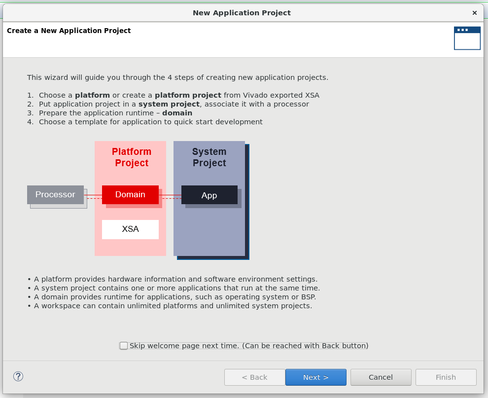

# ○×ゲームでFPGA開発をはじめてみよう(C編)

XilinxのFPGA向けソフトプロセッサであるMicroBlazeを使って，Cで○×ゲームを実装してみましょう．

MicroBlazeを使ったハードウェアの実装の詳細は，[Vitis/Vivado 2020.1でMicroBlazeを使う](https://wasa-labo.com/wp/?p=730)をご覧ください．
ここでは，既に作成済みのハードウェアファイルを使って作業をすすめます．

文中の`$WORK`は，アーカイブを展開したディレクトリ(たとえば`$HOME/work`)を想定します．

## Vitisの起動

リモートデスクトップを使ってACRiにログインしてターミナルを開きます．

```
source /tools/Xilinx/Vitis/2020.2/settings64.sh
vitis &
```

最初にワークスペースを尋ねられます(VitisはEclipseベースです)．他のプロジェクトと設定などがごっちゃになるのは嫌なので，ここでは，このプロジェクト用のワークスペースとして`$WORK/fpga-tic-tac-toe-main/c`を指定しています．


ワークスペースを指定すると起動します．


## プロジェクトの作成

起動ウィンドウの`PROJECT`内の`Create Application Project`をクリックするか，メニューの`File`->`New`->`Application Project...`をクリックしてウィザードを起動します．



ウェルカムページを`NEXT >`ですすむと`Platform`の選択ページが開きます．ここでは，作成済みのMicroBlazeを含むハードウェアデザイン(.xsaファイル)からプラットフォームを作成します．`Create a new platform from hardware (XSA)`を選択し，`Hardware Specification`内の`XSA File:`右の`Browse...`をクリックするとファイル選択ダイアログが開きますので，`$WORK/fpga-tic-tac-toe-main/c/design_1_wrapper.xsa`ファイルを選択します．選択しおえたら`Next >`をクリックして次にすすみましょう．


`Application Project Details`ではプロジェクトの詳細設定です．`Application project name:`にプロジェクト名を指定します．tictactoeにしました．他はデフォルトのまま`Next >`で次にすすみます．


`Domain`ではプロジェクトの実行環境について設定できます．今回はてっとり早くMicroBlaze上にOSなしでソフトウェアを実行したいのでデフォルトのまま`Operating System:`を`standalone`にして`Next >`で次にすすみます．


最後にプロジェクトテンプレートを選択できます．`Hello World`を選択して`Finish`でウィザードを終了しましょう．


プロジェクト設定が完了しました．


## ソースコードの修正

テンプレートで`Hello World`を選ぶと，あらかじめ`helloworld.c`が用意されています．`Explorer`ペインで，`tictactoe_system`->`tictactoe`->`src`とツリーを展開するとファイルにアクセスできます．ダブルクリックすると編集ウィンドウが開きます．

今回は，helloworld.cの中身を，あらかじめ用意した`$WORK/fpga-tic-tac-toe-main/c/helloworld.c`で置換します．

```
cp $WORK/fpga-tic-tac-toe-main/c/helloworld.c $WORK/fpga-tic-tac-toe-main/c/tictactoe/src/helloworld.c
```

## ビルド

ツールバーのトンカチアイコンをクリックしてビルドします．`Explorer`ペインで`tictactoe_syste`を選択した状態でトンカチアイコンをクリックしましょう．


ビルドが終わると，`Consle`ペインにメッセージが表示されます．


## 実行

(1)FPGAにbitファイルをダウンロードする，(2)実行するプログラムを転送して実行する，の手順で実行します．
[RTL編](../verilog/README.md)同様にGtkTermで`/dev/ttyUSB1`を開いておきます．

### FPGAにbitファイルをダウンロードする

メニューから`Xilinx`->`Program Device`を選択します．


`Program Device`ダイアログが表示されます．デフォルトのまま`Program`をクリックします．


プログレスダイアログが表示されて書き込みがすすみますので終わるまで待ちます．


### 実行するプログラムを転送して実行する

`Explorer`ペインで`tictactoe_system`内の`tictactoe`を選択した状態で，ツールバーにある再生ボタン右横の下矢印をクリック，`Run As`->`Launch on Hardware`を選択します．


ウィンドウ右下に進行状態を示すプログレスバーが表示され，完了すると消えます．
GtkTermのウィンドウを確認すると，ゲームが開始しています．

### やってみよう

ツールバーの再生ボタンの左にある虫アイコン右横の下矢印をクリック，`Debug As`->`Launch on Hardware`を選択するとデバッガで実行を制御できます．試してみましょう．
