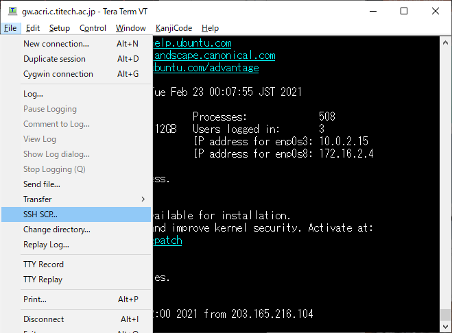

# ACRiでfpga-tic-tac-toeを試す準備をする

ここではTeraTermを使って環境の準備をする方法を紹介します．

はじめに，リソース一式のアーカイブ(ZIPファイル)をGitHubからダウンロードします．


TeraTermでログインします．


メニューバーから `File` -> `SSH SCP...`を選びます．



`From:`のところにダウンロードしたZIPファイルを指定して(`...`ボタンでファイル選択ダイアログが開く)， `Send`ボタンをクリックします．To:を空にするとホームディレクトにコピーされます．


以下のように，ターミナル上で作業ディレクトリを作成してアーカイブを展開します．

```
mkdir -p $HOME/work
cd $HOME/work
unzip ../fpga-tic-tac-toe-main.zip
cd $HOME/work/fpga-tic-tac-toe-main/
```

以上で準備はおしまいです．

この後の作業ではGUI操作をしますのでリモートデスクトップ接続などを利用してアクセスしてください．
詳細は，[ACRi ルームの FPGA 利用環境の予約・使用方法](https://gw.acri.c.titech.ac.jp/wp/manual/how-to-reserve)および，環境に応じて，
- [Windows 10 の「リモート デスクトップ接続」で FPGA 利用環境 (ACRi ルーム) を使う](https://www.acri.c.titech.ac.jp/wordpress/archives/283)
- [macOS の「Microsoft Remote Desktop 10」で FPGA 利用環境 (ACRi ルーム) を使う](https://www.acri.c.titech.ac.jp/wordpress/archives/1730a)
- [Linux (Ubuntu) から Remmina で FPGA 利用環境 (ACRi ルーム) を使う](https://gw.acri.c.titech.ac.jp/wp/manual/how-to-connect-linux)
をご覧ください．
