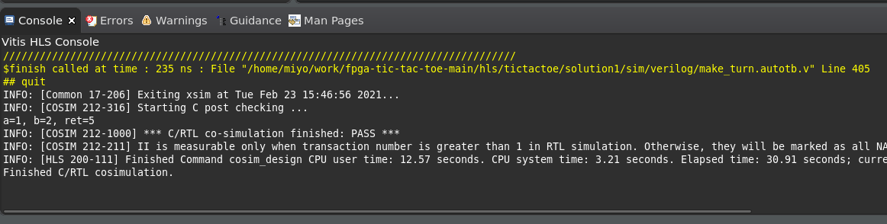

# ○×ゲームでFPGA開発をはじめてみよう(HLS編)

手を決めるモジュールをRTLではなくC++コードから生成してみましょう．
Vitis HLSを使うと，CあるいはC++で記述したコードから同等の処理をおこなうハードウェアモジュールを作ることができます．

文中の，`$WORK`は，アーカイブを展開したディレクトリ(たとえば`$HOME/work`)を想定します．

## Vitis HLSの起動

リモートデスクトップを使ってACRiにログインしてターミナルを開きます．

```
source /tools/Xilinx/Vitis/2020.2/settings64.sh
vitis_hls &
```

と入力すると Vitis HLSのGUIが起動します．


## プロジェクトの作成

起動ウィンドウの`PROJECT`の下にある`Create Project`をクリックするか，メニューバーの`File`->`New Project...`をクリックして，プロジェクト作成ウィザード(`New Vitis HLS Project`)を開きます．

まず`Project Configuration`ダイアログで，`Project name:`に`tictactoe`，`Location:`に`$WORK/fpga-tic-tac-toe-main/hls`をセットして`NEXT >`をクリックします．


`Add/Remove Design Files`と`Add/Remove Testbench Files`は後で作業するので，そのまま`Next >`でスキップします．

`Solution Configuration`で使用するFPGAと作りたいモジュールの動作周波数をセットします．


- `Part Selection`の`Part:`の右にある`...`をクリックすると`Device Selection Dialog`が開きます．`Search:`に`xc7a35ti`と入力して候補を絞り込んで`xc7a35ticsg324-1L`を選択します．


他はデフォルトのまま`Finish`をクリックします．デフォルトだと，`Clock`の`Period:`が`10`になっていて100MHzで動作可能なモジュールを生成するように設定されます．


`Finish`をクリックして少し待つと，プロジェクトの作成が完了します．


## コードの追加

ここでは，既に実装済みのソースコードを登録します．

まず，ハードウェア化したいデザインを登録します．`Explorer`の`Source`を選択，右クリックして`Add Files...`を選びます．


ファイル選択ダイアログで `$WORK/fpga-tic-tac-toe-main/hls/make_turn.cpp` を選択し `Open`をクリックします．


シミューレション用のソースコード(テストベンチ)も登録します．今度は`Explorer`の`Test Bench`を選択，右クリックして`Add Files...`を選びます．ファイル選択ダイアログが開きますので，`$WORK/fpga-tic-tac-toe-main/hls/tb_make_turn.cpp` を選択し`Open`をクリックします．


`Explorer`の`Source`と`Test Bench`の下にファイルが登録できました．


### やってみよう

登録したファイルをダブルクリックするとファイルの内容を確認できます．登録した

- make_turn.cpp
- tb_make_turn.cpp

を開いて中身を確認してみましょう．

## シミュレーションと合成

HLSではC++で記述したテストベンチを使って，(1)デザインをソフトウェアとして実行した場合，(2)高位合成後のハードウェアモジュールを動作させた場合，の両方を確認できます．(1)を`C Simulation`，(2)を`Co-Simulation`と言います．

順に実行していきましょう．まずは，`C Simulation`を実行します．ツールバーの三角のアイコン(再生ボタン)右の下矢印をクリックし，`C Simulation`を選択します．


シミュレーションのオプション設定ダイアログが開きますが，デフォルトのまま`OK`で次にすすみます．


シミュレーションが終わると，`_csim.log`に保存された結果が表示されます．また，ウィンドウ下部の`Console`に実行結果が表示されています．テストベンチに記述した標準出力へのメッセージは，そのまま表示されます．またmain関数の戻り値が0であればシミュレーションが成功したと判断されます．


シミュレーションで正しく実装できていることを確認したら，ハードウェアモジュールを合成します．まず，ツールバーの歯車アイコン右横の下矢印をクリックし，`Project Settings`を選択します．


`Porject Settings`ダイアログが開きますので，左ペインで`Synthesis`を選択します．`Top Function:`右の`Brows...`をクリックすると，`Select Top Function`というダイアログが開きますので，`make_turn(make_turn.cpp)`を選択します．これで，`make_turn`をエントリとする処理一式をハードウェア化する設定が整いました．ダイアログは`OK`で閉じます．


合成は，ツールバーの三角のアイコン(再生ボタン)右の下矢印をクリックし`C Synthesis`を選択して実行します．合成がおわるとリソースや動作周波数の見積りなどの結果が表示されます．


今度は，合成したモジュールが意図した通りに動くことを`Co-Simulation`で確認してみましょう．ツールバーの三角のアイコン(再生ボタン)右の下矢印をクリックし`Co-Simulation`を選択します．`Co-Simulation Dialog`が開きますので，`Dump Trace`で`all`を選択して`OK`をクリックします．


シミュレーションが終わると結果が表示されます．


ウィンドウ下部で`Console`タブを開くと，`C-Simulation`同様にプログラムの出力を確認することができます．



また，ツールバーの一番右のアイコン(`Open Wave Viewer...`)をクリックすると，波形ビューワで動作を確認できます．


Vivadoが起動して波形が表示されます．確認したい信号を選択して波形ビューワにドラッグアンドドロップすると振舞いをみることができます．


信号を確認したらウィンドウの閉じるボタンやメニューバーの`File`->`Exit`でVivadoは終了してください．

### やってみよう

`C-Simulation`と`Co-Simulation`ではC/C++で記述したテストベンチを使って動作を確認することができます．テストベンチは普通のソフトウェアとして記述できます．パタンを追加するなどして動作を確認してみてください．

## IPパッケージの作成

生成したハードウェアモジュールをアーカイブにして保存したり配布したりできます．

ツールバーの三角のアイコン(再生ボタン)右の下矢印をクリックし`Export RTL`を選択します．


`Export RTL`ダイアログが開きます．Vivadoで使う場合，`Format Selection`内のセレクトボックスで`Vivado IP(.zip)`が選択されていることを確認して`OK`をクリックします．


`$HOME/hls/tictactoe/solution1/impl/ip/xilinx_com_hls_make_turn_1_0.zip`ができあがりました．

## Vivadoのプロジェクトの作成

ターミナルで`vivado &`と入力してVivadoを起動します．[RTL編](../verilog/README.md)同様にプロジェクトを作成します．

プロジェクト名は`project_hls`，保存先は`$WORK/fpga-tic-tac-toe-main`としました．


プロジェクト作成ウィザードのサマリを確認して，`Finish`でウィザードを終了します．


## IPリポジトリの追加とIPのインスタンス生成

Vitis HLSで作成したモジュールをVivadoで利用できるように設定しましょう．

`Flow Navigator`の`PROJECT MANAGER`の下にある`Settings`をクリックします．


`Settigns`ダイアログが開くので，左ペインの`Project Settigns`の`IP`の下にある`Repository`を開きます．


`+`ボタンをクリックすると，`IP Repositories`のダイアログが開くので，`$WORK/fpga-tic-tac-toe-main/hls/tictactoe/solution1/imple/ip`を選択して`Select`をクリックします．


IP Repositoriesに登録できました．`Settings`ダイアログは`OK`で閉じましょう．


これで作ったIPを利用できるようになりました．早速IPをプロジェクトに登録しましょう．

`Flow Navigator`の`PROJECT MANGER`にある`IP Catalog`をクリックするとIP Catalogが表示されます．`User Repository`のツリーを展開すると作成した`Make_turn`が見えます．


`Make_turn`をダブルクリックすると，設定ダイアログが開きます．たとえば名前を変更することができますが，ここではデフォルトの`make_turn_0`のまま`OK`をクリックします．


`Generato Output Products`ダイアログを`Generate`で閉じてしばらく待つと，プロジェクトにVitis HLSで作成したIPが登録されます．


## コードの追加

Vitis HLSで作成したコード以外を登録します．大部分は[RTL編](../verilog/README.md)で利用したモジュールを流用します．

`Sources`ペインの`+`をクリックして，`Add Sources`ダイアログを開きます．`Add or create design sources`にチェックを入れて`Next >`をクリックします．`Add Files`をクリックしてファイルを選択します．以下のファイルを選択して`Finish`でダイアログを閉じます．

- HLS編に特化したモジュール
  - `$WORK/fpga-tic-tac-toe-main/hls/verilog/main.sv`
  - `$WORK/fpga-tic-tac-toe-main/hls/verilog/game_manager.sv`
- RTL編と共通のモジュール
  - `$WORK/fpga-tic-tac-toe-main/verilog/src/make_judge.sv`
  - `$WORK/fpga-tic-tac-toe-main/verilog/src/print_board.sv`
  - `$WORK/fpga-tic-tac-toe-main/verilog/src/print_result.sv`
  - `$WORK/fpga-tic-tac-toe-main/verilog/src/recv_user_input.sv`
  - `$WORK/fpga-tic-tac-toe-main/verilog/src/uart_tx.sv`
  - `$WORK/fpga-tic-tac-toe-main/verilog/src/uart_rx.sv`
  - `$WORK/fpga-tic-tac-toe-main/verilog/src/clk_div.sv`


IPコアも追加します．`Sources`ペインの`+`をクリックして，`Add Sources`ダイアログを開きます．`Add or create design sources`にチェックを入れて`Next >`をクリックします．`Add Files`をクリックして以下のファイルを選択して`Finish`でダイアログを閉じます．

- `$WORK/fpga-tic-tac-toe-main/verilog/ipcores/clk_wiz_0/clk_wiz_0.xci`
- `$WORK/fpga-tic-tac-toe-main/verilog/ipcores/vio_0/vio_0.xci`
- `$WORK/fpga-tic-tac-toe-main/verilog/ipcores/ila_0/ila_0.xci`


制約ファイルも追加します．`Sources`ペインの`+`をクリックして，`Add Sources`ダイアログを開きます．`Add or create constraints`にチェックを入れて`Next >`をクリックします．`Add Files`をクリックして`$WORK/fpga-tic-tac-toe-main/verilog/src/main.xdc`を選択，`Finish`でダイアログを閉じてください．

## ビルドと実行

[RTL編](../verilog/README.md)同様にビルドして実行してください．
ただし，ビルド結果は，`$WORK/fpga-tic-tac-toe-main/project_hls/project_hls.runs/impl_1/main.bit`に生成されます．

### やってみよう

合成した結果を`Open Implemented Design`をクリックして表示して確認してみましょう．
