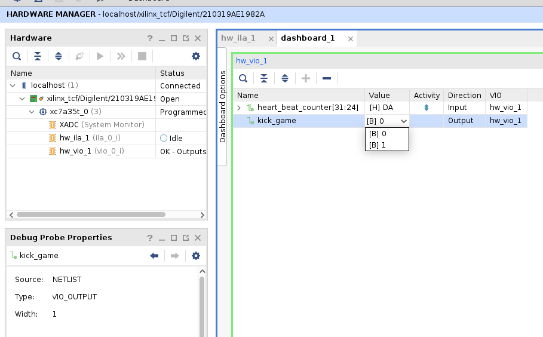
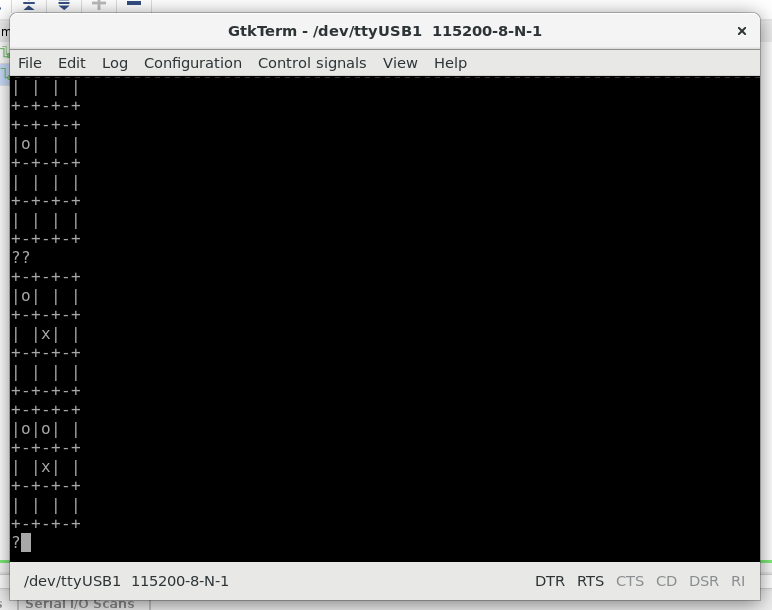

# ○×ゲームでFPGA開発をはじめてみよう(RTL編)

Vivadoを使ったFPGA開発の流れを体験してみましょう．

## Vivadoの起動

リモートデスクトップを使ってACRiにログインしてターミナルを開きます．


ターミナルを開いたら，

```
source /tools/Xilinx/Vivado/2020.2/settings64.sh
vivado &
```

と入力するとFPGA開発ツールのVivadoが起動します．


Vivadoはメニューの`File`->`Exit`やウィンドウの閉じるボタンで終了することができます．

## プロジェクトの作成

Vivadoではプロジェクトという単位で設計します．新しいデザインを作る場合にはプロジェクトの作成からはじめます．

Vivado起動ウィンドウの `Quick Start` の中にある `Create Project > `をクリックすると`New Project`ウィザードがはじまります．


`Next >`をクリックすると，最初にプロジェクト名と格納先ディレクトリの設定を求められます．ここでは，`$WORK/fpga-tic-toc-toe-main`の下に`project_rtl`という名前のプロジェクトを作成するように設定してみました．


`Next >`をクリックするとデザインソースなどに関する設定ダイアログが開きますが，後で設定することにして`Default Part`ダイアログまで`Next >`でスキップします．

`Default Part`では使うFPGAを設定します．ここでは，ACRiに設置されているArtyを利用しますので，(1)`Boards`タブを選択し，(2)Searchフィールドにartyと入力，(3)でてきたArtyを選択します．


`Default Part`でartyを選択後`Next >`をクリックするとプロジェクト作成ダイアログはおしまいです．内容を確認して`Finish`でウィザードを終了します．


プロジェクトが作成できました．


Vivadoではプロジェクトを明示的に保存する必要はありません．Vivadoを終了した後で，プロジェクトを再開したい場合は，起動ウィンドウの`Quick Start`にある`Open Project`をクリックするか，メニューバーの`File`->`Project`->`Open...`を選択してファイル選択ダイアログを開き，プロジェクトファイル(拡張子が`.xpr`)を選択しましょう．

## ソースコードの追加

プロジェクトには，

1. FPGA上に構築したい回路のデザインソース
2. FPGAとロジカルな設計をつなぐ制約ファイル
3. 回路が正しく動くことを確認するためのテストベンチ(シミュレーションを駆動するコード)

の3種類を登録します．それぞれ順にやってみましょう．

### プロジェクトにデザインソースを追加

作成プロジェクトにFPGA上で動作させたいロジックを記述したデザインソースを追加します．

プロジェクト作成直後は`PROJECT MANAGER`というタイトルのパネルが開いた状態になっているはずです．
そうでなければ，プロジェクトの`Flow Navigator`で`PROJECT MANAGER`を選択して`PROJECT MANAGER`パネルを開きます．

ここで，`Sources`ペインの`+`ボタンをクリックします．


`Add Sources`ダイアログが開きます．`Add or create design sources`にチェックが入っていることを確認，入っていなければチェックして`Next >`をクリックします．


`Add Files`ボタンをクリックしてプロジェクトに追加するファイルを選択します．


ここでは，`fpga-tic-tac-toe-main/verilog/src/` 以下の `.sv` という拡張子がついたファイルを全部選択します．


ファイル選択ダイアログで `OK` をクリックすると選択したファイルがリストアップされます．


Finishでダイアログを終了します．

既に設定済みのIPコアも同様に追加します．

同じように `Sources` ペインの `+` ボタンをクリックして `Add Sources` ダイアログを開き，`Add or create design sources` にチェックが入っていることを確認して`Next>`をクリック，`Add Files`をクリックしてファイル選択ダイアログを開き

- verilog/ipcores/clk_wiz_0/clk_wiz_0.xci
- verilog/ipcores/vio_0/vio_0.xci
- verilog/ipcores/ila_0/ila_0.xci

を選択して，`Finish`をクリックします．


### やってみよう

登録されたファイルは，Design Sourcesにぶらさがっています．`>`をクリックするか，ツールバーの`Expand All`(左から3つ目)をクリックするとツリーを展開できます．ファイルを左クリックで選択した後右クリックするとコンテクストメニューが開きます．`.sv`の拡張子がついたファイルは`Open File`で中身をエディタで開くことができます．`.xci`の拡張子がついたファイルは`Re-customize IP...`で設定の変更ができます．

- game_manager.svの中身を見てみましょう．
- clk_wiz_0.xciの設定を開き，入力クロックとIPコアで生成しているクロックを確認してみましょう．確認後ダイアログを`Cancel`で閉じれば変更が反映されませんので安心して操作してください．クロックの設定の詳細を知りたい場合は，[FPGA をもっと活用するために IP コアを使ってみよう (3)](https://www.acri.c.titech.ac.jp/wordpress/archives/45)をご覧ください．

### プロジェクトに制約ファイルを追加

FPGA上にデザインを実装する場合，論理回路と物理的なFPGA上のリソース(たとえば入出力のピン)を設定するためのルールが必要です．ルールを定義している制約ファイルをプロジェクトに追加しましょう．

デザインソースを追加したときと同じように`Add Sources`ダイアログを開き，`Add or create constraints`にチェックを入れて`Next`をクリックします．


制約ファイルである`fpga-tic-tac-toe-main/verilog/src/main.xdc`をプロジェクトに追加してダイアログを閉じます．


### プロジェクトにシミュレーションファイルを追加

デザインソースを追加したときと同じように`Add Sources`ダイアログを開き，今度は`Add or create simulation sources`にチェックを入れて`Next`をクリックします．


`Add Files`をクリックして，`fpga-tic-tac-toe-main/verilog/sim/`の下にあるファイルをプロジェクトに追加してダイアログを閉じます．


## シミュレーション

FPGA上で動作させる前にシミュレーションで設計したデザインが正しく動くことを確認することができます．まずは`print_board_tb`のシミュレーションをしてみましょう．

`Simulation Sources`のツリーを展開し，`print_board_tb`を左クリックして選択します．右クリックしてコンテクストメニューを開き`Set as Top`を選びます．これで`print_board_tb`が太字になって左にマークがつきます．


`Flow Navigator`の`SIMULATION`の下にある`Run Simulation`->`Run Behavioral Simulation`をクリックしてシミュレーションを開始できます．


シミュレーションを開始すると`SIMULATION`パネルが開きました．ツールバーにある三角ボタンをクリックするとシミュレーションの実行です．


なお，実行中に止めたければ右から二番目のボタンで停止することが，指定した時間(10m秒とか)だけシミュレーションを実行したい場合は，三角に(T)がついたボタンをクリックすれば，その右のフィールドに指定した時間だけシミュレーションを実行できます．

シミュレーションが終わると，終了時点のソースコードが表示されます．エラーなどで止まった場合には，その原因を探ることになります．今回は `$finish`で止まってますので，意図通りシミュレーションが終わったことがわかります．


`Untitled 1`タブをクリックすると実行の様子を波形で確認できます．終了時点が拡大された状態になっていると思いますので，`Untitled 1`ペイン中の`Zoom Fit`(矢印が4つのアイコン)をクリックして全体を表示します．


なにかいろいろ動いているように見えます．


少し詳しくみてみましょう．`cout[7:0]`を選択して右クリックしてコンテクストメニューを開き`Radix`->`ASCII`を選びます．これで，この信号をASCII表示(たとえば`0x30`が`'0'`として表示)されます．


シミュレーション波形の適当な位置をクリックすると黄色のカーソル位置をセットできます．


`Untitled 1`ペインのツールバーの虫眼鏡に+のボタンをクリックすると，セットしたカーソル位置を中心に拡大できます．`cout[7:0]`に，何やら○×ゲーム情報が表示されているように見えます．


### やってみよう

同じようにして，

- print_result_tb
- game_manager_tb
- make_judge_tb
- make_turn_tb
- recv_user_input_tb

のシミュレーションもしてみましょう．

別のテストベンチでシミュレーションするためには，`Flow Navigator`の`PROJECT MANAGER`をクリックして`PROJECT MANGER`パネルを開き，`Sources`ペインでシミュレーションしたいテストベンチに対して`Set as Top`を適用した後で，`Run Simultation`->`Run Behavioral Simulation`を実行しましょう．

## ビルド

これで，プロジェクトを作成した後必要なファイルを登録して，シミュレーションで動作を確認した状態にあります．最後にFPGA上で動かすファイル(bitフファイル)を作成しましょう．ソフトウェアプロジェクトでいうビルドですね．

ビルドするには，`Flow Navigator`の`PROGRAM AND DEBUG`の下にある`Generate Bitstream`をクリックします．


最終成果物のbitファイルを作るには，合成(Syntheis)と配置配線(Implementation)を経る必要があります．それらまとめて実行しますよ的なダイアログが表示されるので`Yes`をクリックします．


ビルドに使う資源を設定できますがデフォルトのまま`OK`をクリックします．


ビルド中に進行状態を確認するには，`Flow Navigator`の`PROJECT MANGER`をクリックして`PROJECT MANAGER`パネルを開き，ツールバーのシグマ記号のボタンをクリックして`Project Summary`ペインを表示します．進行状態のぐるぐるが表示されます．

ビルドが終わると，終わりましたダイアログが表示されます．`View Report`にチェックを入れて`OK`でダイアログを閉じましょう．


### やってみよう

`Flow Navigator`にある`IMPLEMENTATION`の下の`Open Implemented Design`で，`IMPLEMENTED DESIGN`ウィンドウを開くことができます．このウィンドウでは，作成したハードウェアのスペックが確認できます．

- `Open Implemented Design`の下の`Report Utilization`などをクリックして(ダイアログはOKして)，スペックを確認してみましょう

Netlistペインでアイテムを選択，右クリックで開くコンテクストメニューで`Select Leaf Cells`をクリックすると，モジュールがどこに配置されたか見ることができます．いろいろなモジュールがどこに配置されたのかみてみましょう．

## 遊んでみる

### FPGAにビットファイルを書き込む

`Flow Navigator`の`PROGRAM AND DEBUG`の下の`Open Hardware Manager`をクリックします．`HARDWARE MANAGER`ウィンドウが開きます．


FPGAにアクセスするために`Open target`->`Auto Connect`をクリックします．


ハードウェアに接続できたところです．


作成したbitファイルをFPGAに書き込むためにFPGAを選択，右クリックしてコンテクストメニューを開き，`Program Device...`をクリックします．


`Program Device`というダイアログが開くので，`Bitstram file:`の右の`...`ボタンをクリックし，`$WORK/fpga-tic-tac-toe-main/project_rtl/project_rtl.runs/impl_1/main.bit`を選択します．`Debug probes files:`には対応するデバッグ情報ファイル`$WORK/fpga-tic-tac-toe-main/project_rtl/project_rtl.runs/impl_1/main.ltx`が自動的に選択されるはずです．


選択したら`Program`ボタンをクリックします．FPGAにデータが書き込まれると`Hardware`ペインには，`XADC`，`hw_ila_1`，`hw_vio_1`が表示されるはずです．ここで，`hw_vio_1`をダブルクリックします．


ダッシュボード開きますよ，なダイアログが開いたら，`OK`でダイアログを閉じます．`hw_vio_1`のダッシュボードが開きます．


ダッシュボード内のツールバーにある`+`ボタンをクリックすると`Add Probes`ダイアログが開きますので，全部選択して`OK`をクリックします．


### シリアルターミナルを開く

デスクトップの`Actitities`をクリックして`Terminal`を選択してターミナルをフロントに表示します．ターミナルでGtkTermを起動します．

```
gtkterm &
```


/dev/ttyS0が開けないという警告は`OK`で閉じます．メニューバーから，`Configuration`->`Port`を開きます．`Port:`に`/dev/ttyUSB1`を，`Baud Rate:`に`115200`をセットします．


### ゲームを開始する

Vivadoに戻って`dashboard_1`ペインの`kick_game`を1にセットするとゲームが開始します．すでに`1`になっていた場合は，一旦`0`にして`1`にします．



ゲームが開始されます．GtkTermを確認すると初期盤面が表示された後にFPGA側が1手打ってきています．


`?`の表示に対して，列と行(いずれも0〜2)を順に入力すると手をすすめることができます．



## ILAで内部を見てみる

ILAを使って動作中のFPGA内部の信号の様子を波形で確認できます．

`Hardware`ペインの`hw_ila_1`をダブルクリックすると`Waveform`が表示されます．`>>`ボタンをクリックすると1024サイクル分の信号の変化が読み取ることができます．


ツールバーの虫眼鏡(`+`,`-`)で拡大・縮小できます．適当に拡大すると内部でカウンタが1ずつインクリメントしている様子がみてとれます．


### 観測する信号を増やしてみよう

`Flow Navigator`で`PROJECT MANGER`を選択すると，`PROJECT MANGER`ウィンドウを表示できます．`Sources`ペインで`Design Sources`のツリーを展開し，`ila_0_i`をダブルクリックするとILAの設定を変更できます．

- `Genrarl Options`タブの`Number of Probes`で観測したい信号を接続するプローブ数を設定
- `Probe_Ports`タブで，各プローブのbit幅を設定
- ソースコード`main.sv`中で`ila_0_i`のプローブに見たい信号を接続する
- デザインの再ビルド

で，観測する信号を増やすことができます．

### 条件にマッチしたタイミング前後の波形を観測しよう

`HARDWARE MANGER`でILAを開いている状態で，`Trigger Setup`ペインでILAで波形を取得する条件をセットすることができます．

また，`Settings`ペインの`Trigger position in window:`にセットした数値で，トリガにマッチングして表示する波形の位置をセットできます．`512`ならトリガがかかった時点より512サイクル前の波形から表示されます．
